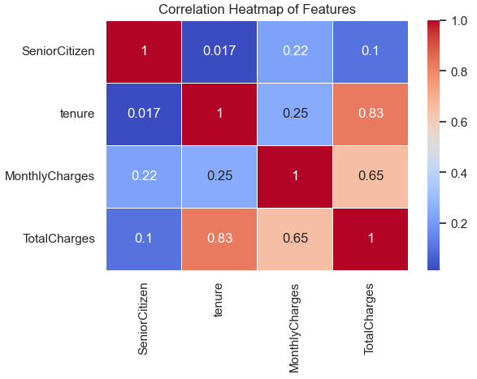

# Teleco-Churn-Analysis
Customer churn analysis using SQL, Python, and Tableau)


---
## Project Overview
This project analyzes customer churn patterns in a telecom company using SQL, Python, and Tableau. By identifying churn factors, the analysis provides actionable insights for improving customer retention strategies. Additionally, predictive modeling was employed to anticipate at-risk customers, enabling targeted interventions.

**_ Disclaimer_** : _All datasets and reports do not represent any company, institution or country, but just a dummy dataset to demostrate my proficiency in Data Analysis tools._

## Objectives
1. Understand customer churn drivers and patterns.
2. Build dashboards and KPIs to track churn metrics.
3. Develop predictive models to identify high-risk customers.

## Tools and Technologies
1. SQL: Data extraction, cleaning, and aggregation.
2. Python: Advanced statistical analysis and visualization.
2. Tableau: Dashboards for interactive insights.

## Skill/Concept Demostrated

### 1. SQL Analysis
- Data Exploration: Understand the structure and quality of the dataset.
- Data Cleaning: Address missing or inconsistent data values.
- Descriptive Analytics: Summarize key trends in the dataset.
- Correlation Analysis: Identify relationships between numerical variables.
- Churn Analysis: Explore customer churn trends based on demographics and contract types.

#### SQL Workflow
##### 1. Database Setup
- Database Created: TelecommChurn
- Table Used: telecomm_customer
 - Schema Verification: Confirmed table structure using DESCRIBE.
##### 2. Data Exploration
- Performed initial checks on data quality and distribution:
- Verified row counts and presence of null values in critical columns.
- Explored categorical variables like Gender, Contract, and PaymentMethod.
- Analyzed churn distribution and customer demographics.

#### Key Queries:
- Count of rows and non-null values.
- Distribution of Gender, Churn, and Contract.
- Frequency of PaymentMethod and other categorical fields.

##### 3. Data Cleaning
- Handled inconsistencies and missing data:
- Standardized the Churn column to numeric values (1 for Yes, 0 for No).
- Checked for invalid or missing entries in TotalCharges and MonthlyCharges.
- Verified updates to Churn column using sample records.

##### 4. Descriptive Analytics
- Generated summary statistics for numerical variables:
- Metrics such as minimum, maximum, average, and standard deviation were calculated for:
- SeniorCitizen
- Tenure
- MonthlyCharges
- TotalCharges
###### Highlights:
- Distribution of MonthlyCharges and TotalCharges was reviewed.
- Identified frequently occurring MonthlyCharges values.

##### 5. Correlation Analysis
-Calculated the Pearson correlation coefficient between:
MonthlyCharges and TotalCharges.

##### 6. Churn Analysis
Explored churn trends based on demographics and contract types:

- Churn distribution across:
- SeniorCitizen status.
- Partner status.
- Contract types.
- Relationship between churn status and:
- MonthlyCharges.
- Tenure.

##### 7. Key Insights
Churn Rate:
- A significant proportion of churn is observed among customers with shorter tenure and higher monthly charges.
###### Demographics:
- Senior citizens are more likely to churn compared to younger customers.
- Customers without partners showed a higher churn rate.
###### Contracts:
- Month-to-month contracts are associated with higher churn rates compared to long-term contracts.
###### Correlation:
-A strong positive correlation exists between MonthlyCharges and TotalCharges.

_SQL Query Snippet:_
```
_-- Correlation between MonthlyCharges and TotalCharges_
 _-- Using the Pearson Correlation Formular [between MonthlyCharges and TotalCharges]_

_SELECT
    (COUNT(*) * SUM(MonthlyCharges * TotalCharges) - SUM(MonthlyCharges) * SUM(TotalCharges)) /
   
    (SQRT(COUNT(*) * SUM(POW(MonthlyCharges, 2)) - POW(SUM(MonthlyCharges), 2)) *
    
     SQRT(COUNT(*) * SUM(POW(TotalCharges, 2)) - POW(SUM(TotalCharges), 2))) AS Correlation
FROM telecomm_customer;_
```
View The Complete SQL Code Here: [(MySQL Telocomm Project  Analysis.sql](https://github.com/Michael-Otebola/Teleco-Churn-Analysis/blob/334513e23c12272b3f9bb8d1921d27cd74d072ae/MySQL%20Telocomm%20Project%20%20Analysis.sql))

<a href=(https://github.com/Michael-Otebola/Teleco-Churn-Analysis/blob/334513e23c12272b3f9bb8d1921d27cd74d072ae/MySQL%20Telocomm%20Project%20%20Analysis.sql))target="blank">View The Complete SQL Code Here</a>

_The correlation between MonthlyCharges and TotalCharges is 0.6511, indicating a moderate to strong positive relationship. As MonthlyCharges increase, TotalCharges also tend to rise proportionally, It means that customers who pay higher monthly charges are likely to have higher total charges over time. This suggests a direct link between how much a customer is billed each month and their overall spending with the company._

## Python Analysis
#### 1. Exploratory Data Analysis (EDA):

- Churn Rate: Identified that 26.54% of customers in the dataset had churned, providing a baseline understanding of the churn rate.
- Correlation Analysis: Generated a heatmap to examine relationships between features. Found strong correlations between MonthlyCharges and TotalCharges, as well as insights on tenure and churn tendencies.
#### 2. Statistical Insights:

###### - Demographic Influence:
- Senior citizens had a higher likelihood of churn compared to non-senior citizens.
- Customers with dependents or partners were less likely to churn.
###### - Service-Based Insights:
- Customers using fiber optic internet services were more prone to churn than those using DSL or no internet service.
- Add-on services like online security and tech support were associated with reduced churn rates.
###### - Contract Type:
Customers with month-to-month contracts showed significantly higher churn rates compared to those on one-year or two-year contracts.
#### 3. Data Visualization:

- Used Seaborn and Matplotlib to create:
- Bar Charts: Highlighting churn rates across demographics and services.
- Box Plots: To display the distribution of MonthlyCharges and TotalCharges across churned and non-churned customers.
- Heatmap: Showcased the correlation matrix for numerical variables.
#### 4. Predictive Analysis:

###### - Initial Logistic Regression Model:
- Achieved an accuracy of 81.9%, with a strong performance in predicting non-churners (precision: 86%, recall: 91%).
- Identified class imbalance, with weaker predictions for churners (precision: 69%, recall: 58%).
###### - Improved Logistic Regression Model with Balanced Weights:
- Adjusted for class imbalance, resulting in improved recall for churners (83%) at the cost of overall accuracy (74.5%).
- Precision for churners increased to 51%, providing a more actionable model for identifying potential churners.

   _Python Code Snippet:_
```
   # Select only numeric columns for correlation
numeric_columns = df.select_dtypes(include=['float64', 'int64'])
###### Check the selected columns
print("Numeric Columns:\n", numeric_columns.columns)

Numeric Columns:
 Index(['SeniorCitizen', 'tenure', 'MonthlyCharges', 'TotalCharges'], dtype='object')
###### Correlation heatmap

plt.figure(figsize=(6, 4))
correlation_matrix = numeric_columns.corr()  # Calculate the correlation matrix
sns.heatmap(correlation_matrix, annot=True, cmap='coolwarm', linewidths=0.5)
plt.title('Correlation Heatmap of Features')
plt.show()
Numeric Columns:
 Index(['SeniorCitizen', 'tenure', 'MonthlyCharges', 'TotalCharges'], dtype='object')
```



Key Insights: Tenure is highly correlated with total charges (0.83):
Customers who stay longer will naturally have higher total charges. This is an important feature to consider when analyzing or predicting churn.
Monthly charges moderately correlate with total charges (0.65):
Higher monthly charges contribute significantly to total charges.
Weak or negligible correlations for SeniorCitizen:
Being a senior citizen does not strongly influence tenure, monthly charges, or total charges.

### - Key Findings:

- High monthly charges are linked to higher churn rates.
- Month-to-month contracts and fiber optic services are significant drivers of churn.
- Customers with longer tenure and bundled services are less likely to churn.


